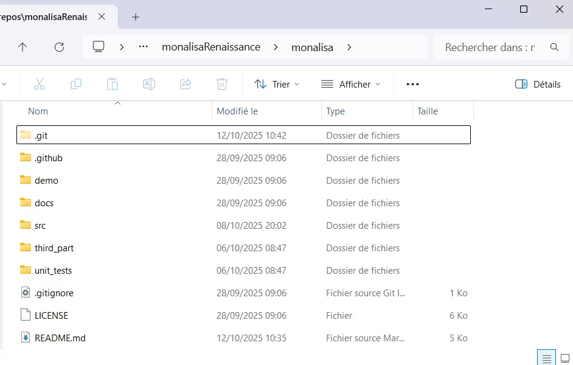

===========
Instalation
===========

Since the code of *Monalisa* is stored in a Github repository, you have to use Git to install the toolbox on your computer. 
If you are used to Git and to command prompt interfaces (terminals), you can directly go to the step *Compilation in Matlab*. 

In the other case, just follow the two simple steps hereafter. Note that you will need to open a terminal to use git properly. 
On Windows, you can use the **powershell** or the **command prompt** terminals. Just search for one of those two by 
typing *powershell* or *command prompt* in the search text box in the start menu. To run a terminal on Linux, 
type *terminal* in the research text box in the start menu.  

Install Git
===========

----------
On Windows
----------

To install git on *Windows*, go to the `git page <https://git-scm.com/downloads/win>`_, download the installer and run it.  
In order to check it Git is installed correclty, open a terminal and type the command

.. code-block:: powershell

    git -v

If the installation succeded you should see an answer like

.. code-block:: powershell

    git version 2.49.0.windows.1

---------
On Linux
---------

If you work on Linux, you probably already know how to install git. In case your are not a specialist of UNIX systems just like me, 
but you try to use Linux, you are probably working on Ubuntu. Then the following command should install Git : 

.. code-block:: powershell

    sudo apt update
    sudo apt install git

In any case, if one of your friends is an LLM (Large Language Model), it will typically gives you a greate help for those kind of things. 
In order to check it Git is installed correclty, open a terminal and type the command

.. code-block:: powershell

    git -v

If the installation succeded you should see an answer like

.. code-block:: powershell

    git version 2.48.1

Clone the repository
====================

First create a folder on your computer were the toolbox will be downloaded. 
For example, name that folder *monalisaRenaissance*. 

Then open a terminal and go into the folder you just created. For me, this was 
done by running the command

.. code-block:: powershell

    cd C:\main\repos\monalisaRenaissance

We are going to clone the monalisa repository inside. For that, go 
to `monalisaRenaissance <https://github.com/monalisaRenaissance/monalisa>`_. Then
click on the green button ``<>Code`` and copy from there the URL of the repository. Go back to you terminal and type

.. code-block:: powershell

    git clone <the URL you just copied>

It should take a few seconds (or minutes if your connection is slow) but after that you should see the 
directory *monalisa* inside the directory you chose to clone it (for me *monalisaRenaissance*). 

Take a first look at the Monalisa folder
========================================

You can now open the Monalisa folder in a graphical navigator and you should be able to see the following content: 

.. raw:: html

   

   
All the functional code of the toolbox is made of functions (matlab or c++), classes, text files and maltab-apps files, which 
are all stored in the ``src`` folder. No scripts, nor data nor any other kind of files are part of the toolbox. Don't modify the 
content of the ``scr`` folder unless you are an advanced user. Only the ``src`` folder, its content and its nested content are 
affected by the license. 

Demonstration scripts and demonstrations data are included in the ``demo`` folder. Playing in this folder is probably the best way
to go in touch with the toolbox (but you have first to complie the c++ code as described in the next section). 

The ``third_part`` folder contains some files written by other authors and are possibly (probably) protected by their own license. 
Some of the Monalisa functions call some function of the ``third_part`` folder to perform some technical tasks, such as data extraction from
rawdata files. 

The ``docs`` folder contains the content of the documentation as well as the material to build it, while the folder ``unit_tests`` 
remains empty for the moment. You don't have to care about ``.git``, ``.github`` or the file ``.gitignore``. These folders and file 
serve for the internal git mechanic. The ``README.md`` file is the one displayed in the git-repository and the ``LICENSE`` is a text file
that contains the license. 

Install a c++ compiler
======================

We cannot give a detailed explanation for that step. It depends mainly on your operating system. Here are however some hints. 

----------
On Windows
----------

Expanation for Windows...

--------
On Linux
--------

Expanation for Linux.....

Compilation in Matlab
=====================

Open matlab and open the Monalisa in the Matlab consol bu typing

.. code-block:: matlab

    cd <your monalisa folder>

For me, that was done by the command

.. code-block:: matlab

    cd C:\main\repos\monalisaRenaissance\monalisa

You have then if Matlab recognizes one or many c++ compilers intalled on your systems. For that ...

