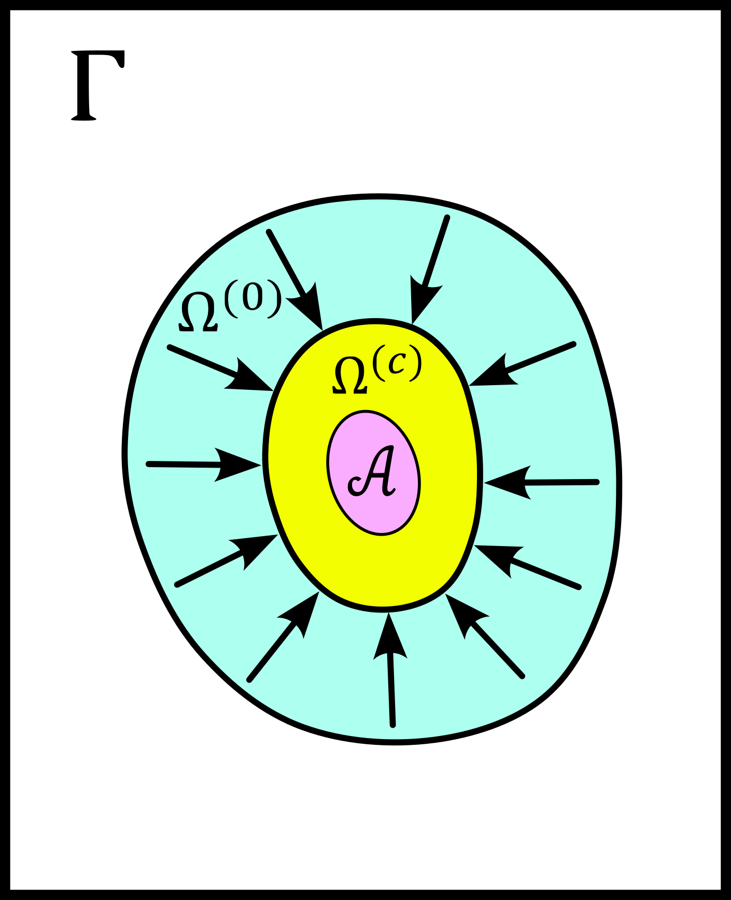
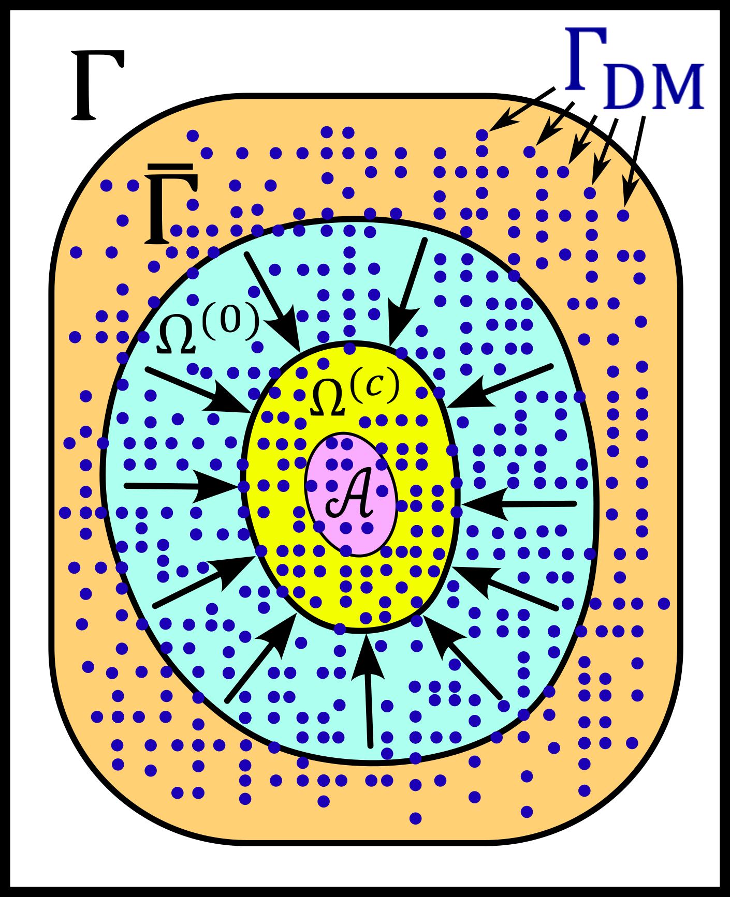

Sketching a Classical Thermodynamic Theory of Information for MRI Reconstructions
=================================================================================

Introduction
------------

The present section is a non-formal essay to sketch some basic features of what could be a 
thermodynamical theory of MRI reconstruction, or more generally, a thermodynamical 
theory of information for iterative algorithms. 

Our idea is to convince the reader that a general picture may be sketched in the future, 
which includes MRI reconstructions, an entropy notion, computers, electrical power, 
reconstruction time, information gain, and artificial intelligence. 
Placing Monalisa in that picture allows in particular to understand the intuition that 
motivated the design of our toolbox: to efficiently consume a 
maximum amount of energy with a high-performance computer (HPC). 

What we do in fact in this text is an analogy between a heat engine and a computer.
In particular, we find a way to describe a computer performing an MRI reconstruction
in the same way that a heat engine is compressing an ideal gas in a cylinder. We try
to describe an iterative reconstruction as a machine that compresses the space of the
dynamical variables of the reconstruction, and thus lowering the entropy of the computer 
memory in the same way that a each engine can lower the entropy of an ideal gas. 

As the reader will notice, this discussion can be applied to any iterative
algorithm that solves an inverse problem. The MRI reconstruction process is used here
as a representant example for any iterative inverse-problem solving process. 
Given the generality of the statements exposed in this discussion, 
we can consider it as an attempt to formulate a classical (non-quantum) 
physical theory of information. In the discussion section, we will make some 
connection with the of **Landauer's principle**, which makes the bridge
between physics and information theory by providing an equivalence between 
energy and information. 

Iterative Reconstructions
-------------------------

Before anything, we would like to indicate that the MRI reconstructions under consideration 
here are iterative reconstructions. These reconstructions appeared historically as iterative 
algorithms to find a minimizer of the non-constrained optimization problem 

.. math::        

    x^\# \in \underset{x \in X}{argmin} \lVert {FC x - y} \rVert ^2_{Y, 2} + \frac{\lambda}{2} R(x)

where :math:`FC` is the linear model of the reconstruction, :math:`X` is the set of MRI images, 
:math:`x` is the candidate MRI image, :math:`Y` is the set of MRI data, 
:math:`y` is the measured MRI data, :math:`\lambda` is the regularization parameter, 
and :math:`R` is a regularization function with some nice properties (typically is :math:`R` chosen to be proper 
closed convex). The objective function of the above optimization problem is made of 

    - a data-fidelity term, which is small when the modeled data :math:`FCx` is close to the measured data :math:`y`,
    - a regularization term, which is small when the image :math:`x` is close to satisfying some prior-knowledge. 

In this formalism, the choice of a regularization function implements a choice of prior-knowledge.   

This *argmin*-problem is the conventional modern formulation of the 
general MRI reconstruction problem as an optimization problem. 
For many choices of regularization function, 
the reconstruction problem has some minimizers and 
there exists some iterative algorithm that converge to one of the minimizers,
which depends usually on the initial image guess. 
The iterative algorithms that solve the above *argmin*-problem are the conventional
iterative reconstruction methods. In addition to these conventional methods, 
some heurisitcs methods are inspired from the conventional ones
but perform some heuristic update of some dynamical variables at each iteration. 
These methods converge in some cases but they do not 
minimize a given objective function and their convergence is not necessarily 
guaranteed by any mathematical formalism. Some examples of such heuristic reconstruction 
are iterative methods where some updates of the image or other 
dynamic variables are done by a statistical model. 
It is an example of use of artificial intelligence for MRI reconstruction. 

Heuristic or not, we consider in the following iterative reconstructions that converges for some given dataset. 
From the view point of discrete dynamical system theory, we can summarize an iterative reconstruction as follows. 
An iterative reconstruction is given by a map :math:`\Phi` from :math:`X \times Z` to :math:`X \times Z`, 
which is parametrized by a list of scalar parameters *param* and the measured data :math:`y`, that we also consider 
as a parameter. Here is :math:`X` the vector space of all MRI images of a given size, 
and :math:`Z` is the cartesian product of all spaces that contain all other dynamical 
variables that we will write as a single list :math:`z`. We consider that a scalar parameter is a 
constant, known, controlled number and :math:`param` is the list of those.
It includes for example the regularization parameter :math:`\lambda`. 
 
It holds then

.. math ::        
    (x^{(c+1)}, z^{(c+1)}) =  \Phi(x^{(c)}, z^{(c)}; \  y, \  param) = \Phi^{(c)}(x^{(0)}, z^{(0)}; \ y, \ param)

Note that we write parameters after the ";" and the dynamical variables before. 

We expect from that dynamical system that for any initial value :math:`(x^{(0)}, z^{(0)})` the sequence
converges to a pair :math:`(x^{(inf)}, z^{(inf)})`,  which may depend on the initial value. The set
of all limits is the **attractor** of the dynamical system, that we will write :math:`\mathcal{A}`.  
The stability of each element *a* of the attractor may then be analyzed by the tool of dynamic system theory.
But from the point of view of application, it makes sense to assume the attractor to not be chaotic.  
Note that in practice, the attractor is larger than a single point and the **bassin of attraction** :math:`\mathcal{B}(a)`
of an element *a* of the attractor (the set of initial values that lead to a sequence converging to *a*)
is also lager than a single point.   

For a given objective function to minimize, the art of building an algorithm that finds a minimizer
consists of building a map :math:`\Phi` for which the projection of its attractor on the 
space :math:`X` co-inside with the set of minimizer of the objective function (or a subset of it).
But as we said, some heuristic iterative reconstruction algorithms are not finding some minimizer of
any objective function. We will therefore consider the projection of :math:`\mathcal{A}` on :math:`X`
as the set of possible reconstructed images. 

We further would like to point out that a non-iterative (single step) reconstruction can 
be seen as an iterative reconstruction. 
For that, we only have to realize that a non-iterative reconstruction is given by a map :math:`\phi`
that does not depends on :math:`(x, z)`: 

.. math ::        
    \Phi(x^{(c)}, z^{(c)}; \  y, \ param) = \phi(y, \ param)

In that sense, all reconstruction are iterative, and those we called "non-iterative" 
converge in a single step since

.. math ::        
    (x^{(c+1)}, z^{(c+1)}) = \Phi(x^{(c)}, z^{(c)}; \  y, \ param) = \phi(y, param) =  \Phi(x^{(0)}, h^{(0)}; \ y ,  \ param)

Iterative reconstruction guided by (based on, using, enhanced by...) an artificial intelligence of any kind 
can be seen as a dynamic system where the implementation of :math:`\Phi` contains some 
statistical model. For example, if :math:`\mathcal{N}` is a neuronal network trained to predict 
some of the dynamical variables from the measured data set and from a database of good quality images, 
it can be used to update that dynamical variable as each iteration. We can then see :math:`\mathcal{N}`
as a parameter of the map :math:`\Phi`: 

.. math ::        
    (x^{(c+1)}, z^{(c+1)}) =  \Phi(x^{(c)}, z^{(c)}; \ y , \  \mathcal{N}, \  param)

In the following, we will not make a distinction between the image :math:`x` and 
the list of other dynamic variables :math:`z`. We will write the current state of all
dynamic variables as 

.. math ::

    \omega = (x, z)

The initial value :math:`(x^{(0)}, z^{(0)})` will thus be written :math:`\omega^{(0)}`
and the current list of all dynamic variables at step :math:`c` will be written :math:`\omega^{(c)}`. 
Also, we will write the list of all parameters as a single list :math:`\theta` such as

.. math ::

    \theta = (y, \  param)

or

.. math ::

    \theta = (y, \  \mathcal{N}, \  param)

We can thus summarize an iterative reconstruction by the formula

.. math ::        

    \omega^{(c)} =  \Phi^{(c)}(\omega^{(0)}; \ \theta)

In summary, an iterative reconstruction is a discrete dynamical system given by a map :math:`\Phi`
with a attractor :math:`\mathcal{A}`, where each element :math:`a \in  \mathcal{A}` has 
its own bassin of attraction :math:`\mathcal{B}(a)`. 

The Phase Space
---------------

We define here our **phase space** of MRI reconstruction. For that, we will 
get some inspiration from the physics. The spirit of phase space in physics is the 
following. The phase space is a set so that each of its element corresponds to exactly one 
of the state that the physical system under consideration can occupy, 
and each of these element carries the complete information about the system occupying that state. 
In classical Hamiltonian mechanic for example, if one knows the position in phase space 
of a physical system at some time, then everything about the system is known at that 
time. In particular, it is then possible to predict all future states of the system and 
find all its past states. In our case of MRI reconstruction, the map :math:`\Phi` that 
dictates the dynamic may not be invertible. We therefore cannot expect to recover 
the past history of a position in phase space, but at least its future states. 
It makes therefore sense to define our phase space as

.. math ::        

    \Gamma =  X \times Z

The state of our system at a given time (a given iteration) is then given by a 
pair :math:`(x, z)` and its knowledge is sufficient to predict all future states 
by iterating :math:`\Phi` on that pair. Note that the attractor :math:`\mathcal{A}` is 
a proper subset of the phase-space :math:`\Gamma`. As said earlier, instead of 
writing :math:`(x, z)` we will just write :math:`\omega`. The phase space is 
therefore the set of possible :math:`\omega` and the map :math:`\Phi` is 
from :math:`\Gamma` to :math:`\Gamma`. 

We can reasonably assume that for any application, :math:`\omega`
can be considered to be a large array of :math:`n` complex or real numbers. 
Since the theory of MRI reconstructions is naturally 
formulated with complex numbers, we will consider that

.. math ::

    \Gamma \simeq  \mathbb{C}^{n/2} \simeq \mathbb{R}^n

for a positive and even integer :math:`n`. 

An iterative reconstruction process can then be described in two steps: 

    - to choose an initial guess :math:`\omega^{(0)}` in a set :math:`\Omega^{(0)} \subset \Gamma`.  
    - to iterate :math:`\Phi` on :math:`\omega^{(0)}` until the obtained value :math:`\omega^{(c)} = \Phi^{(c)}(\omega^{(0)}; \ \theta)` is sufficiently close to the attractor :math:`\mathcal{A}`. 

Here is :math:`\Omega^{(0)}` the set in which we allow to choose the initial values. 

The description of the second step is however not appropriate to the 
thermodynamical description we are going to present. In order to prepare 
the rest of the discussion, we need to reformulate those two steps in 
term of sets and distributions.  For a given subset :math:`\Omega \subset \Gamma` 
we define

.. math ::

    \Phi^{(c)}(\Omega;  \ \theta) := \{\Phi^{(c)}(\omega; \ \theta) \  | \  \omega \in \Omega\}

As already said, our phase space :math:`\Gamma` can be considered as isomorphic to :math:`\mathbb{R}^n` for some 
positive integer :math:`n`. We can thus consider that :math:`\Gamma` can be equipped with the :math:`\sigma`-algebra
of Lebesgue measurable sets, that we will write :math:`\mathcal{L}`, so that  :math:`(\Gamma, \mathcal{L})` is a measurable space. 
We further provide this measurable space with the Lebesgue measure that we will write :math:`\lambda` to obtain a measure space 
:math:`\left( \Gamma, \mathcal{L}, \lambda \right)`. 

We will write :math:`\Omega^{(c)}` the subset of :math:`\Gamma` defined by

.. math ::

    \Omega^{(c)} := \Phi^{(c)}(\Omega^{(0)}; \  \theta)

It is the set that contains :math:`\omega^{(c)}`, whatever the initial value 
of the reconstruction process, as long as it is in :math:`\Omega^{(0)}`.  

Note that given the subset :math:`\Omega^{(0)} \subset \Gamma`, the set of parts

.. math ::

    \mathcal{L}\left(\Omega^{(0)}\right):= \{ \Omega^{(0)} \cap \Omega \  | \  \Omega \subset \mathcal{L} \}

is a :math:`\sigma`-algerba on :math:`\Omega^{(0)}`. More generally, for a subset :math:`S \subset \Gamma` we will define
the :math:`\sigma`-algerba :math:`\mathcal{L}\left(S\right)` as

.. math ::

    \mathcal{L}\left(S\right):= \{ S \cap \Omega \  | \  \Omega \subset \mathcal{L} \}

Let be :math:`\tilde{\mu}^{(0)}` a probability measure on :math:`\Omega^{(0)}` with probability distribution 
function (PDF) given by :math:`p_{\tilde{\mu}^{(0)}}` so that the probability that the random variable associated to 
:math:`\tilde{\mu}^{(0)}` appears in a set :math:`\Omega \subset \Omega^{(0)}` is given by

.. math ::

    \tilde{\mu}^{(0)} \left( \Omega \right) = \int_{\Omega}  d\tilde{\mu}^{(0)} = \int_{\Omega}  p_{\tilde{\mu}^{(0)}}(\omega) d\lambda 

It means that :math:`p_{\tilde{\mu}^{(0)}}` is the Radon-Nikodym derivative 
of :math:`\tilde{\mu}^{(0)}` with respect to :math:`\lambda`. 
It holds in particular

.. math ::

    \tilde{\mu}^{(0)} \left( \Omega^{(0)} \right) = 1 

so that the triple :math:`\left( \Omega^{(0)}, \mathcal{L}\left(\Omega^{(0)}\right), \tilde{\mu}^{(0)} \right)` is a probability space (i.e. a measure space
where the measure of the entire set is 1). The following figure summarizes the situation. 

We now reformulate the two steps of an MRI reconstruction process as follows: 

    - Instead of choosing an initial guess, we chose a probability measure :math:`\tilde{\mu}^{(0)}` as above so that the initial value :math:`\omega^{(0)}` is a random variable with PDF equal to :math:`p_{\tilde{\mu}^{(0)}}`. 
    - We describe then the iteration process as a contraction of :math:`\Omega^{(0)}` by iterating on it the map :math:`\Phi` until :math:`\Phi^{(c)}(\Omega^{(0)}; \ \theta)` becomes sufficiently close to :math:`\mathcal{A}`. 

This description in term of sets and probability distributions makes abstraction 
of the particular image guess and of the reconstructed image. It can be
considered as a mathematical description of the reconstruction of all possible MRI 
images in parallel, that would be obtained by choosing all initial guess
in :math:`\Omega^{(0)}` in parallel, with a given "density of choice" :math:`\tilde{\mu}^{(0)}`. 

The Space of Memory States
--------------------------

The description of the reconstruction in term of phase space, sets and distribution is a mathematical 
description with a phase space isomorphic to :math:`\mathbb{R}^n`. This finite dimensional vector 
space is very convenient for the mathematical description of the dynamical system, and therefore of 
the reconstruction algorithm. In practice however, :math:`\mathbb{R}^n` is not the space where things 
are happening. The algorithm is the physical evolution of a physical system that we call a "computer" and 
the set of states that this physical system can occupy is not :math:`\mathbb{R}^n`. We will 
call **dynamic memory** (DM) the part of the computer memory that is allocated to the dynamic 
variables of the iterative algorithm under consideration. The dynamic memory contains all the variables 
that are changing during the iterative process. One state of the DM corresponds thus to one possible choice 
of the dynamic variable. We will simplify the set of physical states that the computer can occupy by identifying 
it with the set of states of the DM. 

Since the DM is the part of the computer where the state :math:`\omega` is written, it follows that each 
state of the DM correspond to exactly one :math:`\omega \in \Gamma`. We will write :math:`\Gamma_{DM}` the finite 
subset of phase space that contains all possible states of the DM. The finite set :math:`\Gamma_{DM}`
is thus a proper subset of the phase space :math:`\Gamma`.

We will furthermore define the set :math:`\bar{\Gamma}`
to be a compact, proper closed convex subset of :math:`\Gamma` which contains :math:`\Gamma_{DM}`. We will think of
:math:`\bar{\Gamma}` as a set that is just a bit larger than the smallest compact closed convex set that contains
:math:`\Gamma_{DM}`. By "just a bit larger" we want to mean that we allow a minimal "security" distance between
the boundary of :math:`\bar{\Gamma}` and every element of :math:`\Gamma_{DM}`. 

By the definition of :math:`\omega^{(0)}`, it is reasonable to set the restriction

.. math ::

    \Omega^{(0)} \subset \bar{\Gamma}

We can then say informally that :math:`\bar{\Gamma}` is the compact set where everything happens, 
so that we don't have to care about the huge set :math:`\Gamma`. For any set :math:`\Omega \subset \bar{\Gamma}`
we systematically write its intersection with :math:`\Gamma_{DM}` as

.. math ::

    \Omega_{DM}:= \Omega \cap \Gamma_{DM}

The situation is summarized in the following figure. 

We now define the measure :math:`\nu` on the :math:`\sigma`-algebra :math:`\mathcal{L}\left(\bar{\Gamma}\right)` as 
follows. For a given set :math:`\Omega \in \bar{\Gamma}` we count the number of memory states that :math:`\Omega` contains
and we define it to be :math:`\nu \left( \Omega\right)`: 

.. math ::

    \nu \left( \Omega \right) := \# \left(\Omega \cap \Gamma_{DM} \right) = \# \left(\Omega_{DM} \right)

where "#" returns the cardinality of a set. One can check as an exercises that is in fact define a measure. 

The measure :math:`\nu` allows to define the measure space 
:math:`\left(\bar{\Gamma}, \mathcal{L}\left(\bar{\Gamma}\right), \nu\right)`. 
In order to work with the same set :math:`\bar{\Gamma}` and the same :math:`\sigma`-algebra 
:math:`\mathcal{L}\left(\bar{\Gamma}\right)` for all measures, we extend the above introduced 
measure :math:`\tilde{\mu}^{(0)}` over :math:`\bar{\Gamma}` by defining

.. math ::

    \tilde{\mu}^{(0)} \left(\Omega\right):= \tilde{\mu}^{(0)} \left(\Omega \cap \Omega^{(0)} \right)

for all :math:`\Omega \in \bar{\Gamma}`. It follows that the :math:`\tilde{\mu}^{(0)}` measure of any 
set that does not intersect :math:`\Omega^{(0)}` is zero. The PDF :math:`p_{\tilde{\mu}^{(0)}}` can be extended
from :math:`\Omega^{(0)}` to :math:`\bar{\Gamma}` by setting it equal to :math:`0` for any state outside :math:`\Omega^{(0)}`. 

Since we defined a measure :math:`\nu`, there exist the temptation to work with its distribution function, 
but such a function does not exist unfortunately. The best we can think of as a density function for :math:`\nu` could be

.. math ::

    f_{\tilde{\nu}}(\omega):= \frac{\# \left(B_{\epsilon}(\omega) \cap \Gamma_{DM} \right)}{\lambda\left(B_{\epsilon}(\omega)\right)}

where :math:`B_{\epsilon}(\omega)` is the open ball of radius :math:`\epsilon` centered in :math:`\omega`. This function defines a measure
:math:`\tilde{\nu}` on :math:`\bar{\Gamma}` by

.. math ::

    \tilde{\nu}\left(\Omega\right) = \int_{\Omega} d\tilde{\nu} = \int_{\Omega}  f_{\tilde{\nu}}(\omega) \ d\lambda \approx \nu\left(\Omega\right)

Although the function :math:`f_{\tilde{\nu}}` is interesting from a theoretical point of view, 
it leads only an approximation of :math:`\nu`. In the following, we will work with :math:`\nu`
and we will not need :math:`\tilde{\nu}`.

We note finally that the measure :math:`\nu \left(\Omega\right)` is linked to the number of bit that are needed to encode all states 
of the memory that are in :math:`\Omega`. Since :math:`\nu \left(\Omega\right)` is the number of such states, we can write
the number of bits needed to encode them as

.. math ::

    nB \left(\Omega\right) := log_2\left(\nu \left(\Omega\right)\right)

It follows from that definition that

.. math ::

    \nu \left(\Omega\right) = 2^{nB \left(\Omega\right)}

If we now start the iterative algorithm by an initial guess in the set :math:`\Omega^{(0)}` and iterate 
the map :math:`\Phi` until :math:`\Omega^{(0)}` is compressed to :math:`\Omega^{(c)}`, the number of
bits needed to encode all states in :math:`\Omega^{(0)}` shrinks to the number of bits needed to encode all
states in :math:`\Omega^{(c)}`. This reduction of needed number of bits is

.. math ::

    nB \left(\Omega^{(0)}\right) - nB \left(\Omega^{(c)}\right)  = log_2\left(\nu \left(\Omega^{(0)}\right)\right) - log_2\left(\nu \left(\Omega^{(c)}\right)\right) = - log_2\left(    \frac{  \nu \left(\Omega^{(c)}\right)  }{\nu \left(\Omega^{(0)}\right)}     \right)                         

Rewriting this reduction of bit number as :math:`\Delta B^{(c)}` we get

.. math ::

    \Delta B^{(c)}  = - \frac{1}{log(2)} \  log\left(    \frac{  \nu \left(\Omega^{(c)}\right)  }{\nu \left(\Omega^{(0)}\right)}     \right)                         

In the next sub-section, we will define the information gain :math:`\Delta I^{(c)}` associated to the compression of :math:`\Omega^{(0)}` to
:math:`\Omega^{(c)}` as

.. math ::

    \Delta I^{(c)} := -log\left(    \frac{  \nu \left(\Omega^{(c)}\right)  }{\nu \left(\Omega^{(0)}\right)}     \right)

It follows from those definition that the relation between the reduction of bit number and information gain is

.. math ::
    
    log(2) \ \Delta B^{(c)}  = \Delta I^{(c)}

In the discussion sub-section, we will argument that Landauer's erasure can be re-interpreted as this reduction of
bit number. 

The Heat Engine
---------------

Work is the useful thing that a heat engine gives to some part of the universe that we will call the **work environment**. 
Although this "work environment" is usually not part of the thermodynamic descriptions, there is nothing wrong about it: 
it is just the part of the universe the heat engine is acting on. This notion will appear to be convenient for the rest of
the text. The heat engine performs some work in the work environment by transferring heat from a hot to a cold reservoir. 
The *heat engine* and the *working environment* are two subsystems and the hot reservoir, cold reservoir and the *rest of the universe*
are three other subsystems. Their union being the universe (the total system). 

   .. image:: images/discussion/thermodyn_info/heat_engine_1.png
      :width: 50%
      :align: center
      :alt: heat_engine_1

The heat engine operates in a cyclic way so that its state is the same at the beginning of each new cycle. 
In contrast, the states of the work environment, the *rest of the universe* and the heat reservoirs 
can evolve along the cycles. The goal of a heat engine
is in fact to transform the work environment, else the engine would be useless. The transformation of the work
environment often translates in a lowering of its **entropy**, while the entropy of 
the *rest of the universe* together with the heat reservoirs is increasing. The transformation is reversible exactly if
the entropy of the universe (total system) remains constant during that transformation. 
If the transformation is irreversible, the entropy of the universe increases, even if entropy of the work environment decreases.  
Since the entropy is a function of state, the entropy of the heat engine is the same at the beginning (and end) of each cycle. 

For the coming comparison between a computer and a heat engine, we would like to focus on the special case
described in the following figure. 

   .. image:: images/discussion/thermodyn_info/heat_engine_2.png
      :width: 50%
      :align: center
      :alt: heat_engine_2

It represents a heat engine that gives energy to a working environment (*WE*) in the form of a mechanical work amount :math:`\Delta W`. 
This work is used to compress an ideal gas in a cylinder in thermal contact with the cold reservoir at temperature :math:`T_C`. 
In order to be able to evaluate entropy changes, we admit that no irreversible loss of energy happens. 
This means that the heat engine is an ideal (reversible) heat engine, which is called a *Carnot engine*. It has therefore
maximal efficiency. We also have to assume that the gas compression is isothermal, which means
that the movement has to be sufficiently slow as guaranteed by the coupling of the small and large wheels. 
We admit that there is a good isolation between the *rest of the universe* and to two subsystems implied in the process, 
which are the heat engine and the WE. A flow of energy travels through the subsystem made of the pair *heat-engine + WE*. 
At each cycle of the engine, a heat amount

.. math::

    E_{in} = \lvert \Delta Q_H \rvert

enters that subsystem and a heat amount

.. math::

    E_{out} = \lvert \Delta Q_C \rvert + \lvert \Delta Q_{WE} \rvert

leaves that sub system. Since the temperature of the gas in the *WE* do not changes, its internal energy do not
change as well. That means that the work :math:`\Delta W` is equal to the expelled heat amount :math:`\lvert \Delta Q_{WE} \rvert`. 
The conservation of energy reads thus: 

.. math::

    \lvert \Delta Q_H \rvert = \lvert \Delta Q_C \rvert + \lvert \Delta Q_{WE} \rvert

The volume of the ideal gaz is decreased by an amount :math:`\lvert \Delta V \rvert` at each cycle.
We will write :math:`V > 0` the volume of the ideal gaz at the current cycle. 
The change of entropy :math:`\lvert \Delta S_{WE} \rvert` is therefore negative and given by

.. math::

    \Delta S_{WE} = N \cdot k_B \cdot log\left(\frac{V-\lvert \Delta V \rvert}{V}\right) < 0
    
where :math:`N` is the number of particle of the ideal gas and :math:`k_B` is the Boltzmann constant.  

During one cycle, the hot reservoir experiences a drop of entropy by an amount

.. math::

    \Delta S_{H} = -\frac{\lvert \Delta Q_H \rvert}{T_H}

while the cold reservoir experiences a grow of entropy by an amount

.. math::

    \Delta S_{C} = +\frac{\lvert \Delta Q_C \rvert}{T_C}

Since the engine comes back to the same state after every cycle and since entropy
is a function of state, there is no change of entropy in the engine after each cycle. 
Assuming the process to be reversible, the total entropy is conserved: 

.. math::

    \Delta S_{C} + \Delta S_{H} + \Delta S_{WE} = 0

If the process is now irreversible (like any realistic, non-ideal process), the entropy drop in the ideal gas will 
still be the same since the entropy is a function of state, but the heat exchanges will be different and
this will lead to a positive entropy grow of the universe (the total system) by the second law of thermodynamic, 
even if entropy was locally decreased in the ideal gas: 

.. math::

    \Delta S_{C} + \Delta S_{H} + \Delta S_{WE} + \Delta S_{Rest} > 0

where the subscript :math:`Rest` refers to the *rest of the universe*. 

This scheme of producing an energy flow through a system in order to drain out some of its entropy
(a side effect being an entropy grow of the universe) is a general scheme encountered everywhere 
in engineering and nature. Plants and animal do that all the time. We eat energy to produce 
mechanical work such as moving from a place to the other, but a large part of the energy we eat 
is expelled as thermal radiation associated to a drop of our entropy. In fact, our body continuously
experiences injuries because chance unbuild things more often that it builds it. Those injuries are structural 
changes that have a high probability to happen by chance alone and which correspond to an increase of entropy of
our body. Because of injuries, the entropy of our body tends to increase. In order to survive, 
we have to consume energy to continuously put our body back to order i.e. to a state that has very little 
chance to be reached by chance a lone, that is, a state a low entropy. Repairing our body implies thus to 
consume energy to lower our entropy back to an organized state and that implies to expel an 
associated amount of heat by radiation. This scheme is so universal that we will now try
to apply it to computers in order to build an analogy with the eat engine. We will try that way to deduce
a definition of thermodynamical quantities in the context of iterative algorithms. 

The Computer as an Engine
-------------------------

Here are a few empirically facts. If the reader does not agree with them, 
just consider that they are assumptions. We assume furthermore that the iterative reconstruction 
in question is correctly implemented. 
 
    1. Given a converging iterative reconstruction for some given data, the image quality along iterations improves then monotonically, at least in average in some temporal window.   
    2. Each iteration of an iterative reconstruction consumes electric power and time, the product of both (or time integral of power) being the energy consumed by that iteration.
    3. An image, together with the other dynamic variables of the algorithm, is physically a state of the dynamic memory. A converging reconstruction process is a process that changes the state of that memory until the resulting state do not longer significantly changes. 
    4. During an iterative reconstruction process, if the reconstructed image improves and converges (at least in average in some temporal window), the computer absorbs electrical energy, a part of that energy serves to set its memory in a certain state, and most of the absorbed energy is released in the environment as heat.  
    5. A reconstructed image of good quality is an image that models the measured data reasonably well (relative to a given model), and which satisfies some prior knowledge reasonably well. Both criteria result in a low value of the objective function if that function exist. 
    6. An image of good quality corresponds to some states of the dynamic memory that have very little chance to be found by chance alone, for example by a random search for a good image. 

It is not the intention of the author to build some axioms of a mathematical theory. 
The empirical facts above are in fact redundant to some extends, but we don't
really care. We just want to build an intuition for a thermodynamic theory of MRI reconstruction.

The intuition following from those fact is that the computer consumes **energy** to set its memory in a state of low **entropy**, 
and that those states of low entropy are the element of the attractor of the algorithm i.e. the elements that are solution
of the problem our iterative algorithm is solving. It is intuitively clear that an iteration that moves the current state :math:`\omega` 
towards the attractor (and thus lower the entropy of the memory) must consume energy, but the reverse does however not need to be true: 
more energy consumption does not need to lead to an image quality gain, since energy can be directly dissipated into heat. 
A notion of **efficiency** is therefore missing and there is no obvious definition for it. Intuitively, it makes sense to define 
efficiency in such a way that it expresses a gain in the result quality related in some way to the energy consumed for that gain. 
But there is no obvious definition for that efficiency. 

Instead of trying to force a definition, we propose to develop a thermodynamic theory of the computer in order
identify what could be the natural notion for thermodynamical quantities in that context. We will build a "computer engine"
in analogy to the heat engine in order to inherit some notions from thermodynamic to the context of information and algorithms. 
We will then propose some definition of efficiency, thermodynamical entropy, information theoretical entropy and information
along the way. 

During an algorithm is running, electrical energy given to the computer and is expelled as heat 
in the cooling system, which may be interpreted as the cold reservoir. In order to make an analogy between the computer and
the heat engine, we define the following virtual partition of the universe:  

    - the **electric power supply system** *(PS)*, which transfers energy to the computer, 
    - the **computer** *(Comp)*, with the computational units and including the part of memory that contains the program, but without the part of memory that contains the dynamic variables of the reconstruction process, 
    - the part of memory that contains the dynamic variable of the reconstruction process, that we will call the **dynamic memory** (*DM*). 
    - the **cooling system** *(C)* of the computer.
    - the **rest of the universe**, which also absorb parts of the heat released by the computer. 

Note that the union of these five parts is the universe. 

   .. image:: images/discussion/thermodyn_info/computer_engine_1.png
      :width: 50%
      :align: center
      :alt: heat_engine_1

A very important fact about our description is that the dynamic memory (DM) is considered to be out of the computer, 
which was not explicitly stated until now in our description. It means that the DM is virtually separated from the rest of the computer 
in our virtual separation of the universe in subsystems. The DM is the analog of the working environment for the heat engine. 

We propose here to consider the computer as an engine and to interpret one iteration of the reconstruction
process as one cycle of the engine. In fact, at the beginning of each iteration, the state of the computer 
is the same since we consider all changing (dynamic) variables to be in the DM, 
which is the analog of the work environment of the heat engine. The energy given to the computer is almost completely
dissipated into heat transmitted to the cooling system at temperature :math:`T_C`. We neglect transmission of heat given to
the *rest of the universe* because it should be much smaller. Also, there are some
electro-magnetic radiations emitted from to the computer to the *rest of the universe* and some electrostatic energy
that is stored in the memory, since writing information in it implies to set a certain configuration of charges
with the associated electro-static energy. These two energy amounts are however so small as compared to the energy 
dissipated in the cooling system that we will neglect them. As a consequence of energy conservation, we will therefore write
for one cycle

.. math ::        
    
    \Delta E_{in} = \lvert \Delta Q_C \rvert

That means that all the energy entering the computer is dissipated as heat in the cooling system. 
Following the intuition that this flow of energy drains out some (thermodynamical) entropy from the
dynamic memory (DM) as it brings it in a state that can hardly be reached by chance alone, 
we expect that a negative entropy change :math:`-\lvert \Delta S_{DM} \rvert` is produced in the DM during one
cycle (one iteration) of the MRI reconstruction process. If our intuition is correct, the second law of thermodynamic 
implies then

.. math ::        
    
    \Delta S_{DM} \geq \frac{\Delta Q_C}{T_C}

where equality holds for a reversible process. But the quantities :math:`\Delta S_{DM}` and :math:`\Delta Q_C` are signed in that expression. 
Assuming :math:`\Delta S_{DM}` to be negative, we deduce

.. math ::        
    
    \lvert \Delta S_{DM} \rvert \leq \frac{\lvert \Delta Q_C \rvert}{T_C}

Since the computer is in the same state at the beginning of each iteration, it experiences no entropy change
between each start of a new iteration. The entropy change in the system *computer + DM* is therefore 
to be attributed to the entropy change in the DM only. The previous inequation means that for an entropy drop
of magnitude :math:`\lvert \Delta S_{DM} \rvert` in the DM, there must be a heat amount of magnitude at least
:math:`T_C \lvert \Delta S_{DM} \rvert` expelled to the cooling system. We will write :math:`E^{tot}` the total amount 
of energy given to the computer for the reconstruction and :math:`\lvert \Delta S_{DM}^{tot} \rvert` the magnitude
of the total entropy drop in the *DM* during reconstruction. It follows from the previous equation, 
from our formula for energy conservation and from the fact the temperature of the cooling system is constant, that

.. math ::        
    
    \lvert \Delta S_{DM}^{tot} \rvert \leq \frac{E^{tot}}{T_C} \quad (E1)

If we express :math:`E^{tot}` as the multiplication of the input electric power :math:`P` and the total 
reconstruction time :math:`\Delta t^{tot}`, we get

.. math ::        
    
    \lvert \Delta S_{DM}^{tot} \rvert \leq \frac{P \Delta t^{tot}}{T_C}

If we can find a way to establish the magnitude of the total entropy drop in the DM associated
to a desired quality of result, for a known electric power, we could then deduce a minimal 
reconstruction time for the desired MRI quality. 

We have done a first analysis of what could be a computer engine by formulating the first and second law 
of thermodynamic for the chosen virtual partition of universe. 
The analogy between the computer and the heat engine is however limited
because we are for the moment unable to define what the computer is transmitting to the DM, 
as pointed out by the quotation mark in the last figure. The reason is that the computer
performs no mechanical work and we have to find a replacement for work in order to continue the 
analogy. We implement a solution to the problem in the next subsection. 

A Postulate for the Thermodynamical Entropy of the Dynamic Memory
-----------------------------------------------------------------

We propose to solve our difficulties by the following heuristic (actually quite esoterique) construction. 
Instead of considering that the computer interacts with the dynamic memory, we consider that 
nature is *as if* the computer was interacting with the phase space. The variables stored 
in the DM represents one state in the phase space, but since it could be any, the computer 
behaves in a way that would do the job for any state in the phase space. We consider therefore 
that it is a reasonable argument to say that the behavior of the 
computer is related phase space and not related one particular representant. 
The computer behaves as if it was reconstructing many MRI images at the same time. Instead of
discussing endlessly how realistic or not that argumentation is, we propose here one implementation
of that idea and we will pragmatically try to see what are the implications.  

In analogy to the isothermal compression of an ideal gas, we will consider that the computer
is compressing a portion :math:`\Omega^{(0)}` of phase space by iterating the map :math:`\Phi` that dictates
the evolution of the iterative MRI reconstruction algorithm. We chose :math:`\Omega^{(0)}` to be the
region of phase space where there is a non-zero probability that our initial value :math:`\omega^{(0)}`
is chosen. For convenience, we will like to think of :math:`\Omega^{(0)}` as a proper closed convex set. 
We recall that it contains the attractor :math:`\mathcal{A}` of the dynamical system. We define the set

.. math ::        
    
    \Omega^{(c)} := \Phi^{(c)}(\Omega^{(0)}; y, param)

We imagine that :math:`\Omega^{(c)}` *is* the set :math:`\Omega^{(0)}` compressed by :math:`\Phi` after
:math:`(c)` iterations. We imagine that :math:`\Omega^{(c)}` contains an ideal *phase space gas* and 
that at each iteration, a part of the energy given to the computer is transformed in a kind of 
*informatic work* :math:`\Delta W` to compress that phase space gas. We will therefore 
call :math:`\Omega^{(c)}` the **compressed set** at iteration :math:`c`. 
The situation is described in the following figure. 

   .. image:: images/discussion/thermodyn_info/computer_engine_2.png
      :width: 50%
      :align: center
      :alt: heat_engine_2

We will imagine that any connected proper subsest :math:`\Omega` of phase space with non-zero Lebesgue measure
contains a certain amount of our "phase space ideal gas". Inspired by the equation that describes 
an ideal gas with constant temperature :math:`T_C`, we set

.. math ::        
    
    p \cdot V = T_C \cdot k_{\Gamma}

where :math:`p` is the pressure of our phase space gas, :math:`V` is its volume given by the measure :math:`\nu` as

.. math ::        
    
    V = \nu \left(\Omega \right)

and :math:`k_{\Gamma}` is the ideal gas constant of our phase space gas. 
It follows that

.. math ::        
    
    p \cdot dV = T_C \cdot k_{\Gamma} \cdot \frac{dV}{V}

We deduce that the work :math:`\Delta W` needed to compress :math:`\Omega` to a smaller subset is :math:`\Omega'` is

.. math ::        
    
    \Delta W = - k_{\Gamma} \ T_C \  \int_{\nu \left(\Omega \right)}^{\nu \left(\Omega' \right)} \frac{dV}{V} = - k_{\Gamma} \ T_C  \  log \left( \frac{\nu(\Omega')}{\nu(\Omega)} \right) 

We will now label some quantities with the super-script :math:`(c, c+1)` to indicate that the quantity in question
is associated to the iteration number :math:`(c)`, which performs the transition from state :math:`(c)` to state :math:`(c+1)`. 
We will also label a quantity with super-script :math:`(c)` in order to indicate that this quantity is associated to the transition
from the initial state to the state number :math:`(c)`.  

We can now express the conservation of energy (the first law of thermodynamic) as follows. 
An energy amount :math:`\Delta E_{in}^{(c, c+1)}` 
is given to the computer, an amount :math:`\Delta E_{in}^{(c, c+1)} - \Delta W^{(c, c+1)}` is dissipated 
to the cooling system by the computation at temperature :math:`T_C`, and another 
amount :math:`\Delta W^{(c, c+1)}` is given as work to the phase space and then also dissipated 
to the cooling system as a heat amount :math:`\lvert Q_{DM}^{(c, c+1)} \rvert` at 
temperature :math:`T_C`. It holds thus

.. math ::        

    \lvert \Delta Q_{DM}^{(c, c+1)} \rvert = \Delta W^{(c, c+1)}  

and we define 

.. math ::

    \Delta Q_{Comp}^{(c, c+1)} := \Delta E_{in}^{(c, c+1)} - \Delta W^{(c, c+1)}
    
the heat amount dissipated by the computation directly to the cooling system. This is the part of the energy that is not 
"transmitted" to the phase space. The conservation of energy can then be rewritten as

.. math ::        

    \Delta E_{in}^{(c, c+1)} = \lvert \Delta Q_{Comp}^{(c, c+1)} \rvert + \lvert \Delta Q_{DM}^{(c, c+1)} \rvert

Of course, the phase space is a mathematical, non-physical object and 
the *work given to phase space* is a symbolic language. What we try to do is an 
intellectual effort that consists in admitting that nature behaves *as if* the 
computer was in fact transmitting work to the phase space. 

From analogy of phase space with an ideal gas, we postulate that 
the (physical) thermodynamical entropy drop in the *DM* during iteration number :math:`(c+1)` is 

.. math :: 
    
    \Delta S^{(c, c+1)}_{DM} = k_{\Gamma} \cdot log \left( \frac{\nu(\Omega^{(c+1)})}{\nu(\Omega^{(c)})} \right)

The total entropy drop due to all iterations until (and with) iteration number :math:`(c)` is therefore

.. math :: 

    \Delta S^{(c)}_{DM} = \Delta S^{(0, 1)}_{DM} + ... + \Delta S^{(c-1, c)}_{DM} 

and thus

.. math :: 

    \Delta S^{(c)}_{DM} = k_{\Gamma} \left(log \left( \frac{\nu(\Omega^{(1)})}{\nu(\Omega^{(0)})} \right) + ... + log \left( \frac{\nu(\Omega^{(c)})}{\nu(\Omega^{(c-1)})} \right)\right) = k_{\Gamma} \  log \left( \frac{\nu(\Omega^{(c)})}{\nu(\Omega^{(0)})} \right)

Our postulate for the entropy change of the DM can also be express from state :math:`0` to state :math:`c` as

.. math :: 
    
    \Delta S^{(c)}_{DM} = k_{\Gamma} \cdot log \left( \frac{\nu(\Omega^{(c)})}{\nu(\Omega^{(0)})} \right) 

Assuming that DM and cooling system are in thermal equilibrium, the process is then reversible and the second law of thermodynamic implies

.. math :: 
    
    \Delta S^{(c)}_{DM} =  -\frac{\lvert \Delta Q_{DM}^{(c)} \rvert}{T_C} = k_{\Gamma} \cdot log \left( \frac{\nu(\Omega^{(c)})}{\nu(\Omega^{(0)})} \right)

This is consistent with a reversible isothermal compression of an ideal gas, as assumed. 
We will assume that the *rest of the universe* experiences no heat exchange during a reversible process so 
that the entropy of that part is unchanged. Since the computer is a cyclic engine, it is also 
experiencing no changes of entropy between the beginning or each new cycle. The non-zero entropy changes during the reversible process
are therefore those of the power supply system :math:`\Delta S^{(c, c+1)}_{PS}`, 
of the cooling system :math:`\Delta S^{(c, c+1)}_{C}`, and of the DM written :math:`\Delta S^{(c, c+1)}_{DM}`. 
For a reversible transformation holds thus

.. math ::

    \Delta S^{(c, c+1)}_{PS} + \Delta S^{(c, c+1)}_{C} + \Delta S^{(c, c+1)}_{DM} = 0

The entropy change of the cooling system can be evaluated as

.. math ::        

    \Delta S^{(c, c+1)}_{C} = \frac{\lvert \Delta Q^{(c, c+1)}_{Comp} \rvert }{T_C} + \frac{\lvert \Delta Q^{(c, c+1)}_{DM} \rvert }{T_C}

By substitution of the above formulas holds

.. math ::

    \Delta S^{(c, c+1)}_{PS} + \frac{\lvert \Delta Q^{(c, c+1)}_{Comp} \rvert }{T_C} = 0

This is the expression of second law for the total system in the case of a reversible process. 
If the process is not reversible (as any realistic process) we expect inequations instead of the equations above. 
For the dynamic memory, the second laws for an irreversible heat transfer implies

.. math ::

    \Delta S^{(c, c+1)}_{DM} \geq - \frac{\rvert \Delta Q_{DM}^{(c, c+1)} \lvert }{T_C} \quad (E2)  

For the cooling system, the second law implies 

.. math ::

    \Delta S^{(c, c+1)}_{C} \geq \frac{\lvert \Delta Q^{(c, c+1)}_{Comp} \rvert }{T_C} + \frac{\lvert \Delta Q^{(c, c+1)}_{DM} \rvert }{T_C}

For the power supply system, we simply assume that the second law implies

.. math ::

    \Delta S^{(c, c+1)}_{PS} \geq 0

and similarly for the *rest of the universe*

.. math ::

    \Delta S^{(c, c+1)}_{Rest} \geq 0

Where the subscript :math:`Rest` refers to the *rest of the universe*. 
As mentioned above, the entropy change of the computer over one cycle is zero.  
The entropy change for the total system reads then

.. math ::
    
    \Delta S^{(c, c+1)}_{PS} + \frac{\lvert \Delta Q^{(c, c+1)}_{Comp} \rvert }{T_C} + \Delta S^{(c, c+1)}_{Rest} \geq 0

We have thus formulated the first law for the total system as well as the second low for the total system in the case of
a reversible process and an irreversible process. 

The key notion introduced in the present subsection is a postulate for the physical, thermodynamical
entropy of the DM. We postulate that the physical entropy drop in the DM can be described in term of 
a mathematical compression of :math:`\Omega^{(0)}` instead of physical quantities. 

Information and Efficiency
--------------------------

For the coming comparison with information theory in the next subsection, 
we define the information gain associated the transition 
from :math:`\Omega^{(c)}` to :math:`\Omega^{(c+1)}` as

.. math ::        
    
    \Delta I^{(c, c+1)} := - log \left( \frac{\nu(\Omega^{(c+1)})}{\nu(\Omega^{(c)})} \right)

We define as well the gain of information associated to all iterations until (and with) iteration number :math:`c` as

.. math ::        
    
    \Delta I^{(c)} := \Delta I^{(0, 1)} + ... +\Delta I^{(c-1, c)}

it follows

.. math ::        

    \Delta I^{(c)} = - \left( log \left( \frac{\nu(\Omega^{(1)})}{\nu(\Omega^{(0)})} \right) + ... + log \left( \frac{\nu(\Omega^{(c)})}{\nu(\Omega^{(c-1)})} \right) \right) = - log \left( \frac{\nu(\Omega^{(c)})}{\nu(\Omega^{(0)})} \right)

By our postulate for the entropy change in the dynamic memory, and by our definition of
information gain it holds

.. math ::        
    
    \Delta S^{(c)}_{DM} = - k_{\Gamma} \  \Delta I^{(c)} = k_{\Gamma} \  log \left( \frac{\nu(\Omega^{(c)})}{\nu(\Omega^{(0)})} \right) \quad (E3)

We get then a relation between physical work (in Joule *J*) and information, for iteration number :math:`{c+1}`, given by

.. math ::        

    \Delta W^{(c, c+1)} = T_C \cdot k_{\Gamma} \cdot \Delta I^{(c, c+1)} 

Alternatively, for all iteration until (and with) iteration number :math:`{c}`, we obtain

.. math ::        

    \Delta W^{(c)} = T_C \  k_{\Gamma} \  \Delta I^{(c)} \quad (E4)
 
It follows in particular from these last two equations that, 
whatever the unit of information is, the constant :math:`k_{\Gamma}` must
have the unit *J/K/[Unit of Information]*. We are now able to define 
a notion of *efficiency* :math:`\eta^{(c, c+1)}` as the ratio of the input energy
:math:`\Delta E_{in}^{(c, c+1)}` (during one cycle) and the work performed 
on the phase space :math:`\Delta W^{(c, c+1)}`: 

.. math ::        

    \eta^{(c, c+1)} := \frac{\Delta W^{(c, c+1)}}{E_{in}^{(c, c+1)}} =  T_C \  k_{\Gamma} \  \frac{\Delta I^{(c, c+1)}}{E_{in}^{(c, c+1)}} 

If we admit that the *DM* experiences an entropy drop of 
magnitude :math:`\lvert \Delta S^{(c, c+1)}_{DM} \rvert` during one 
iteration. We deduce from (E3) that

.. math ::        

    \lvert \Delta S^{(c, c+1)}_{DM} \rvert \leq \frac{\lvert \Delta Q_{DM}^{(c, c+1)} \rvert}{T_C} = \frac{\Delta W^{(c, c+1)}}{T_C} = \frac{\eta^{(c, c+1)} \cdot E_{in}^{(c, c+1)}}{T_C}

If the efficiency is constantly equal to a number :math:`\eta`, summing up all contribution 
of the entire reconstruction duration leads

.. math ::
    
    \lvert \Delta S^{tot}_{DM} \rvert \leq \frac{\eta \cdot E_{in}^{tot}}{T_C} = \eta \frac{ P \cdot \Delta t^{tot}}{T_C}

which is a more severe constraint on the entropy drop of the *DM* as compared to the one we got earlier. It follows in 
particular that

.. math ::
    
    \Delta I^{tot} \leq  \frac{\eta}{k_{\Gamma}} \frac{ P \cdot \Delta t^{tot}}{T_C} \quad (E5)

This inequation is the main result of our theory. We will see in a next section that it is actually
equivalent to Landauer's principle if we set :math:`k_{\Gamma}` equal to the Boltzmann constant. 
We will also deduce a new interpretation of Landauer's erasure
in term of bit number reduction needed to encode the states in the compressed set. 

Connection with the Theory of Information
-----------------------------------------

In the previous subsection, we introduced some relation between the physical energy *E* 
and the thermodynamical entropy *S* as well as a notion of information *I* with some 
relation to *E* and *S*. 

In this section, we will introduce some relations that relates the 
thermodynamical entropy *S* to the information theoretical entropy *H*. 
The entropy *H* is always defined on a probability distribution while we defined an entropy notion 
*S* for some subset :math:`\Omega` of the phase space :math:`\Gamma`. The simplest way to relate them
is to define a probability function for any given subset :math:`\Omega \subset \Gamma`. We proceed as follows. 

Since :math:`\Gamma_{DM}` is a finite set, we will call :math:`nDM` its cardinality. 
It is the number of states that can be stored in the dynamic memory. 
Let be :math:`\omega_i`, the element number :math:`i` in :math:`\Gamma_{DM}`, 
where :math:`i` runs from :math:`1` to :math:`nDM`. For a given subset :math:`\Omega \subset \Gamma`, 
we define the probability :math:`p_i` for :math:`\omega_i \in \Gamma_{DM}` as

.. math::

    p_i=
    \left\{
    \begin{array}{ll}
    \frac{1}{\nu\left(\Omega\right)} & \text{for} \ \omega_i \in \Omega \\
    \text{0} & \text{else}
    \end{array}
    \right.

This assigns to each :math:`\Omega \subset \Gamma` a probability distribution on the set :math:`\Gamma_{DM}`. 
We can then evaluate its entropy *H* as 

.. math ::

    H = - \sum_{i = 1}^{nDM} p_i \ log(p_i) = log\left(\nu\left(\Omega\right)\right)

and therefore

.. math ::

    H = log\left(\frac{\nu\left(\Omega\right)}{\nu\left(\Omega^{(0)}\right)}\right) + log\left(\nu\left(\Omega^{(0)}\right)\right)

Since this entropy is associated with the set :math:`\Omega`, we will write it :math:`H \left(\Omega\right)`. 
We now identify :math:`\Omega` with the compression of :math:`\Omega^{(0)}` by :math:`c` iterations, which is the set :math:`\Omega^{(c)}`. 
The associated information theoretical entropy is then

.. math ::

    H \left(\Omega^{(c)}\right) = log\left(\frac{\nu\left(\Omega^{(c)}\right)}{\nu\left(\Omega^{(0)}\right)}\right) + H \left(\Omega^{(0)}\right)

We define the change of information theoretical entropy :math:`\Delta H^{(c)}` as

.. math ::

    \Delta H^{(c)} := H \left(\Omega^{(c)}\right) - H \left(\Omega^{(0)}\right)

By definition of the information gain :math:`\Delta I^{(c)}`, the (thermodinamical) entropy change of the DM :math:`\Delta S_{DM}^{(c)}`, 
and the number of bit reduction :math:`\Delta B^{(c)}`, we obtain

.. math ::

    k_{\Gamma} \ \Delta H^{(c)} = -k_{\Gamma} \ \Delta I^{(c)} =  \Delta S_{DM}^{(c)} = - k_{\Gamma} \  log(2) \ \Delta B^{(c)}

If our definition are well chosen, these four notions are, up to a factor, different names for the same thing.  

Parallel Computing
------------------

We redefine in this section our notion of entropy change :math:`\Delta S`,
information theoretical entropy change :math:`\Delta H`, 
information gain :math:`\Delta I`, and number of bit reduction :math:`\Delta B`
in the case of :math:`N` copies of the dynamic memory being updated in parallel by the same
iterative algorithm. In this context, each copy of the dynamic memory 
is storing its own dynamic variable independently 
of each other. The :math:`N` copies of the dynamic memory are physically different memory storage systems
that are physically very identical, which are informatically identical, but which all have their individual existence.  
We will write  :math:`\omega_i` the dynamic variable stored in the dynamic memory number
:math:`i`. Each :math:`\omega_i` can be different from the others and they are all independent. 

In order to describe that system, we define a new single state :math:`\omega` as the list 

.. math ::

    \omega = \left(\omega_1, ..., \omega_N \right)

in the new phase space 

.. math ::

    \Gamma^N := \Gamma \times ... \times \Gamma

which obeys to all definition we did until now. We only have to replace 
:math:`\Gamma` by :math:`\Gamma^N` and :math:`\omega` by 
:math:`\left(\omega_1, ..., \omega_N \right)` in all our definitions. 

We will ow do that but we will keep the same definition for :math:`\Omega^{(0)}` and 
:math:`\Omega^{(c)}` as above. Since the algorithm is behaving in the same way irrespectively of the 
particular state of each dynamic memory, the set :math:`\Omega^{(0)}` is the same for all 
DMs and so is the set :math:`\Omega^{(c)}`. Only the particular representant :math:`\omega_i`
can differ between DMs. The start value :math:`\omega^{(0)}` is in the set :math:`{\Omega^{(0)}}^N`
and the state :math:`\omega^{(c)}` at iteration :math:`(c)` is in the set :math:`{\Omega^{(c)}}^N` given by

.. math ::

    {\Omega^{(c)}}^N = \Phi^{(c)} \left({ \Omega^{(0)} }^N ; \theta \right)

In that expression, we silently redefined :math:`\Phi` on :math:`\omega \in \Gamma^N` component wise by

.. math ::

    \Phi \left( \omega \right) := \left(\Phi\left(\omega_1\right), ..., \Phi\left(\omega_N\right)  \right)

For a subset :math:`\Omega \subset \Gamma`, the number of states in :math:`{\Omega}^N \subset {\Gamma}^N` 
is simply :math:`{\nu \left(\Omega\right)}^N`.  That means

.. math ::

    \nu\left( {\Omega}^N \right) = {\nu \left(\Omega\right)}^N

By our definition of the entropy change :math:`\Delta S^{(c)}`, the compression from :math:`{\Omega^{(0)}}^N`
to :math:`{\Omega^{(c)}}^N` corresponds to an entropy change

.. math ::

    \Delta S^{(c)} = k_{\Gamma} \  log \left(\frac{{\nu \left(\Omega^{(c)}\right)}^N}{{\nu \left(\Omega^{(0)}\right)}^N}\right) = N k_{\Gamma} \  log \left( \frac{\nu \left(\Omega^{(c)}\right)}{\nu \left(\Omega^{(0)}\right)}\right) \quad (E6)

In a similar way, we deduce that the work to perform that compression is given by

.. math ::        
    
    \Delta W =  - N \  k_{\Gamma} \  T_C  \  log \left( \frac{    \nu \left(\Omega^{(c)}\right)    }{   \nu \left(\Omega^{(0)}\right)    }\right)

Since the informatic work :math:`\Delta W` to perform the set compression is equal, by our assumption, to the heat released by the dynamic memory, 
it follows that this heat amount is also multiplied by :math:`N` for the parallel execution of the algorithm on :math:`N` dynamic variables. 

The definitions of :math:`\Delta I`, :math:`\Delta H` and :math:`\Delta B` are equal to :math:`\Delta S` up to a constant, 
they are also all multiplied by :math:`N` for the parallel computing. We conserve thus the relation

.. math ::

    k_{\Gamma} \ \Delta H^{(c)} = -k_{\Gamma} \ \Delta I^{(c)} =  \Delta S_{DM}^{(c)} = - k_{\Gamma} \  log(2) \ \Delta B^{(c)}

We note finally that the  work :math:`\Delta W` is the mechanical work that would be needed to compress a gas verifying the law

.. math ::

    p \ V = N \ k_{\Gamma} \ T_C

which is similar, up to the constant :math:`k_{\Gamma}`, to the ideal gas law. The 
formulas are as if the :math:`N` independent dynamical variables :math:`\left(\omega_1, ..., \omega_N \right)`
were living in the same volume inside phase space :math:`\Gamma` in a similar way like :math:`N` particles of an
ideal gas are evolving in the same physical volume without interacting between each other.  

Connection with the Landauer's Principle
----------------------------------------

By writing the total consumed energy as :math:`\Delta E^{tot}`, and by writing the temperature :math:`T_C` as :math:`T` 
(which is the temperature at which the computer operates), equation (E5) can be rewritten as

.. math ::
    
    k_{\Gamma} \ T \  \Delta I^{tot} \leq  \eta \  \Delta E^{tot} \quad (E7)

This equation is very similar to the principle of Landauer, which reads

.. math ::
    
    k_{B} \ T \  log(2) \leq   \Delta E

where :math:`k_{B}` is the Boltzmann constant, :math:`T` is the temperature of the computer and :math:`\Delta E` 
is the practical energy amount that is needed to erase a *bit* of information.  
Since Landauer's principle is formulated "per bit", we can write it more generally for :math:`\Delta B` bits as

.. math ::
    
    k_{B} \ T \  log(2) \Delta B_{erased} \leq   \Delta E \quad (E8)
 
where :math:`\Delta E` is now the energy needed to erase :math:`\Delta B_{erased}` bits. If we substitute :math:`\Delta I^{tot}`
by the equivalent expression for the number of bit reduction :math:`\Delta B`, 
equation (E7) becomes

.. math ::

    k_{\Gamma} \ T \  log(2) \Delta B \leq  \eta \  \Delta E^{tot} \quad (E9)

which is now very close to Landauer's principle. The main difference is the presence of constant :math:`k_{\Gamma}`
instead of :math:`k_B`. This suggests to set

.. math ::

    k_{\Gamma} = k_B

Equation E9 becomes then

.. math ::

    k_B \ T \  log(2) \Delta B \leq  \eta \  \Delta E^{tot} \quad (E10)

By interpreting the useful energy :math:`\eta \ E^{tot}` as being :math:`\Delta E`, and by interpreting the
number of erased bits :math:`\Delta B_{erased}` as the number of bit reduction :math:`\Delta B` in the context of iterative algorithms, 
Landauer's principle E8 is equivalent to E10, which is the equation that follows from our postulate for the change of entropy in the 
dynamic memory. We have thus demonstrated that our postulate for the entropy of the dynamic memory leads to an expression that can be interpreted to be
to Landauer's principle extended to the iterative algorithms. 

Given the temperature dependency of E8 and E10, which is so that the information gain
explodes when temperature is going to :math:`0`, it is natural to wonder weather these equations could be the classical 
limit of a quantum equation, since the nature of quantum computing is to exploit the properties of matter for 
very low temperature. Although it is purely speculative, it may then be that the number of particles :math:`N` becomes the
number of dynamic variables that are existing in parallel in the quantum algorithm.  

Connection with Statistical Mechanic
------------------------------------

The entropy of an ideal gas, for a constant number of particles :math:`N` and constant temperature, can be expressed up
to a constant as

.. math ::

    S = N \ k_B \ log(V) + const.

An analogy with our ideal phase space gas and equation (E6) suggests, for the entropy of the dynamic memory, an expression of the form: 

.. math ::

    S = k_B \  log\left( {\nu \left(\Omega\right)}^N \right) + const = N \  k_B \  log\left( \nu \left(\Omega\right) \right) + const

Neglecting the constant leads

.. math ::

    S = k_B \  log\left( \nu \left({\Omega}^N\right) \right)

The Boltzmann entropy formula reads

.. math ::

    S = k_B \  log\left( \Omega \right)

where :math:`\Omega` is the area of the surface in phase space occupied by all the possible micro states of a given energy 
for the physical system under consideration (it is the "number" of allowed micro-states, if one prefers). 
Both entropy formula are very similar because the meaning of :math:`\Omega` in Boltzmann formula has a similar meaning like
the symbol :math:`\nu \left({\Omega}^N\right)` : it is the number of states that the system under consideration can occupy.  

It seems therefore that a connection between our theory with statistical mechanic may be possible. But for the moment both
theories are quite different, mainly because our notion is volume is equal to the number of states that DM can occupy, 
while in statistical mechanic are volume and number of possible states different notions. A unification will therefore need 
a work of reformulation. 

Artificial Intelligence as an Amplification of Efficiency
---------------------------------------------------------

We will not speculate of what artificial intelligence (AI) could be in the future and what it could achieve potentially. 
Rather, we will consider it as what it is for the moment in the context of MRI reconstruction:  
artificial intelligence in MRI reconstruction consists in replacing the evaluation of some dynamical variable
(image, deformation field or other algorithm variable) by some statistical prediction that are faster to perform
if the model could be trained in advance on some good quality ground truth data. 

For the moment, it seems therefore that the use of AI allows the same gain of information as the non AI algorithms
but in a smaller amount of time, and therefore by consuming less energy. It may seem at first sight that AI 
can allow to violate some lower energy bound set some physical principle, such as Landauer's principle. But if we think 
that training an AI consumes actually a large amount of energy and that the data the AI is trained on also needs
a large energy amount to be reconstructed, it becomes clear that a careful sum of all energy contributions must be
done in order to perform a correct analysis. 

We will call :math:`E \left(GT\right)` the energy amount needed to produce the data that serves to train the AI
("GT" stands for "ground truth") and we will call :math:`E \left(\mathcal{N}\right)` the energy needed to train 
the statistical model (i.e. the AI). We will write :math:`E_i` the energy needed to perform a non AI algorithm
on data number :math:`i` in order to obtain a certain quality in the result. Finally, we will write :math:`E^{AI}_i` the
energy needed by an AI informed algorithm that leads to the same quality of its non AI counterpart for data 
number :math:`i`. We run now :math:`R` times the non AI algorithm on :math:`R` different data. The total consumed energy is 
therefore 

.. math ::

    E_{tot} = E_1 + ... + E_R

If we run the AI informed algorithms on the same data until the same quality of result is obtained, the total consumed
energy is

.. math ::

    E^{AI}_{tot} = E^{AI}_1 + ... + E^{AI}_R + E \left(GT\right) + E \left(\mathcal{N}\right)

The assumption that the AI reconstruction consumes less energy that its non AI counterpart reads

.. math ::

    E^{AI}_i < E_i

For a large enough :math:`R` we can then reach

.. math ::

    E^{AI}_{tot} < E_{tot}

This means that the initial energy investment :math:`E \left(GT\right) + E \left(\mathcal{N}\right)`
becomes valuable for sufficiently many reconstructions. 

We will call :math:`\langle E \rangle` the average energy consumption of the non AI algorithm so that

.. math ::

    E_{tot} = R \cdot \langle E \rangle

and will call :math:`\langle E^{AI} \rangle` the average energy consumption of the AI algorithm so that

.. math ::

    E^{AI}_{tot} = R \cdot \langle E^{AI} \rangle

It follows that for sufficiently many run of the algorithms holds

.. math ::

    \langle E^{AI} \rangle < \langle E \rangle

We will write :math:`\Delta I^{tot}` the total information gain of all non AI reconstruction, 
which is by our definitions also equal to the total information gain of all AI reconstruction. 
By our definition of efficiency, and assuming it to be constant for simplicity, it follows 
that the efficient of the non AI reconstruction is given by

.. math ::

    \eta = k_{\Gamma} \ T_C \ \frac{\Delta I_{tot}}{R \ \langle E \rangle}

and that the efficiency of the AI reconstruction is given by

.. math ::

    \eta^{AI} = k_{\Gamma} \ T_C \ \frac{\Delta I_{tot}}{R \ \langle E^{AI} \rangle}

Their ratio verifies

.. math ::

    \frac{\eta^{AI}}{\eta} = \frac{\langle E \rangle}{\langle E^{AI} \rangle}

and therefore

.. math ::

    \eta^{AI} = \eta \ \frac{\langle E \rangle}{\langle E^{AI} \rangle} > \eta

The efficiency of the AI algorithm is then an amplification of the efficiency of the non AI algorithm.  
This amplification of efficiency is inherently linked to the fact that the AI reconstruction consumes less energy
than the non-AI one for the same information gain. We will therefore rewrite the above relation in term of 
energy differences in order to highlight their implications. We define

.. math ::

    \Delta E_i := E_i - E^{AI}_i > 0

We define their average as

.. math ::

    \langle\Delta E\rangle := \frac{1}{R} \sum_{i = 1}^{R} \Delta E_i

We also define the initial energy investment of the AI algorithm as

.. math ::

    E_0^{AI} := E \left(GT\right) + E \left(\mathcal{N}\right)

We note then

.. math ::

    E_{tot} - E^{AI}_{tot} = \sum_{i = 1}^{R} \Delta E_i - E_0^{AI}

A division by :math:`R` leads then

.. math ::
    
    \langle E \rangle - \langle E^{AI} \rangle = \langle\Delta E\rangle - \frac{E_0^{AI}}{R}

For a large enough :math:`R`, we can therefore neglect :math:`E_0^{AI}` and assume

.. math ::

    \langle E \rangle \approx \langle E^{AI} \rangle + \langle\Delta E\rangle

It follows

.. math ::

    \frac{\langle E\rangle}{\langle E^{AI}\rangle}\approx 1 + \frac{\langle\Delta E\rangle}{\langle E^{AI}\rangle}

and therefore

.. math ::

    \eta^{AI} \approx \eta \ \left(1 + \frac{\langle\Delta E\rangle}{\langle E^{AI}\rangle} \right) > \eta

This situation is as if AI was a way to reuse information contained in the ground truth in order to complete
the information that has to be computed to treat the supplementary data set numbered from :math:`1` to :math:`R`. 
The reuse of the ground truth information requires an addition cost of energy to train a statistical model. 
But since this energy investment has to be done only once, it becomes valuable for a large :math:`R`.
The situation is depicted in the following figure. 

   .. image:: images/discussion/thermodyn_info/re_use.png
      :width: 50%
      :align: center
      :alt: heat_engine_2

We have written :math:`\Delta I\left(GT\right)` the information gained by constructing the ground truth, 
:math:`\Delta I_i` the information gained to treat data number :math:`i` with the non AI algorithm, 
and :math:`\Delta I^{AI}_i` the information gained to treat data number :math:`i` with the AI algorithm. 

Conclusion
----------

We have done two postulates on the entropy change of the *Dynamic Memory* (DM) of a computer (the part of memory that is changed by
the iterative algorithm): 

- At each iteration of the algorithm, the entropy of the DM experience a negative change :math:`\Delta S`. 
- This negative change is given quantitatively by

.. math ::

    \Delta S = N \ k_B \ log\left(\frac{\nu\left({\Omega}^{(c+1)}\right)}{\nu\left({\Omega}^{(c)}\right)}\right)

In the second postulate is :math:`N` is the number of parallel instances of the memory that the algorithm 
is updating (which is :math:`1` for non-parallel computing), :math:`k_B` is the Boltzmann constant, 
:math:`{\Omega}^{(c)}` is the phase space sub-set that contains with 100% chance the dynamic variable of any of the 
memory instance at iteration number :math:`c`, and :math:`\nu\left({\Omega}^{(c)}\right)` is the number of 
memory state (for a single memory instance) that is contained in the phase space subset :math:`{\Omega}^{(c)}`. 

We have thus postulated some expression for the physical entropy change in the dynamic memory of a computer
which rely on the mathematical dynamic variables of the algorithm rather than on some physical quantities. 
That way, we built a bridge between the physical word and the mathematical world of information. 
We did not prove that our statement for the physical entropy change in the dynamic memory
was correct or wrong, but we showed that by a clever definition of information gain, our statement
was very close to the known Landauer's principle. That connection is interesting in itself. 

Although less strong, we also showed some connection from our entropy postulate to the theory of information
as well as to statistical mechanic. 

We also showed that from our definition of efficiency follows, that the use of AI in iterative algorithms
to update some of the dynamic variables at each iteration results in an efficiency amplification. 
In this context, AI appears like a technology that allows to directly reuse some of the information gained during 
the ground truth data construction, instead of re-computing everything again 
for every new data to treat, as it is done by non AI algorithm. If our view is correct, AI allows to indirectly 
reuse a part of the energy used to construct ground truth data. In that case, it should be advantageous to consume
a maximum amount of energy to build good quality ground truth data. 
This is motivation behind Monalisa.
