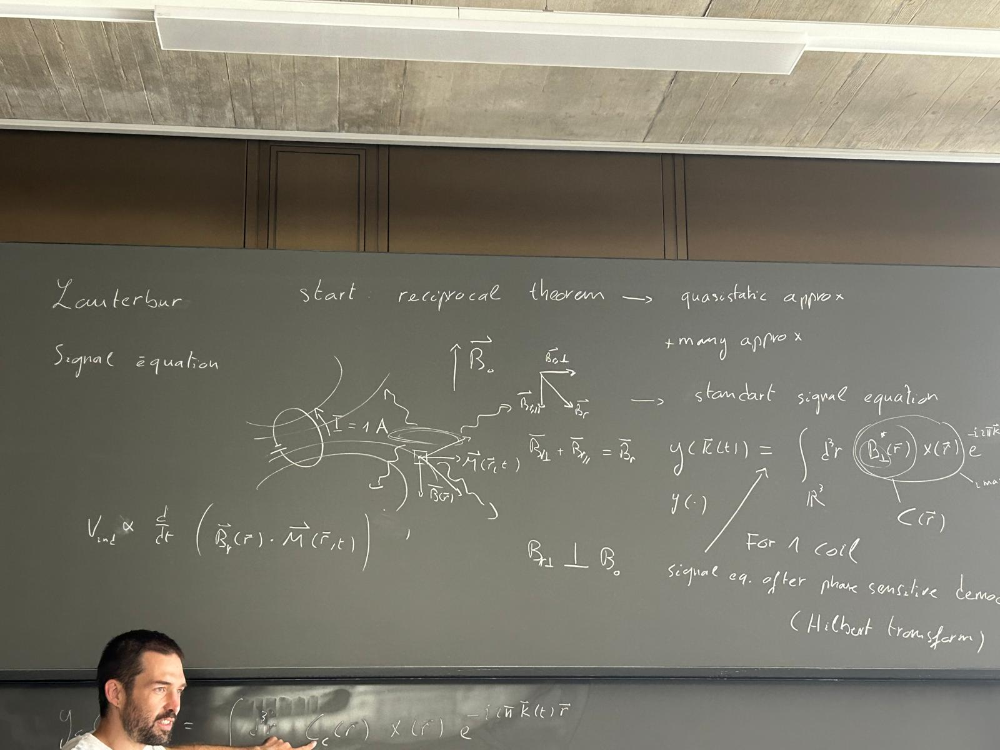

.. doc_renaissance documentation master file, created by
   sphinx-quickstart on Fri Sep 26 13:49:57 2025.
   You can adapt this file completely to your liking, but it should at least
   contain the root `toctree` directive.

=========================================================
MRI Reconstructions from the Theory to the Implementation 
=========================================================

.. toctree::
   :maxdepth: 3

   1_instalation
   2_introduction
   3_demos

.. Indices and tables
.. ==================

.. * :ref:`genindex`
.. * :ref:`modindex`
.. * :ref:`search`
